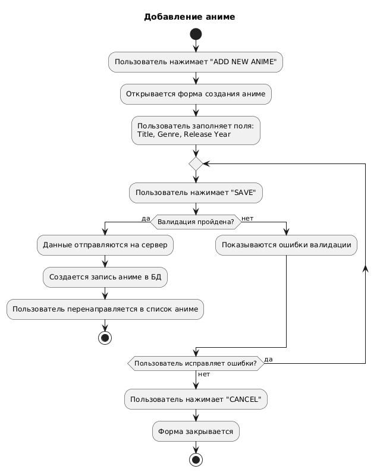
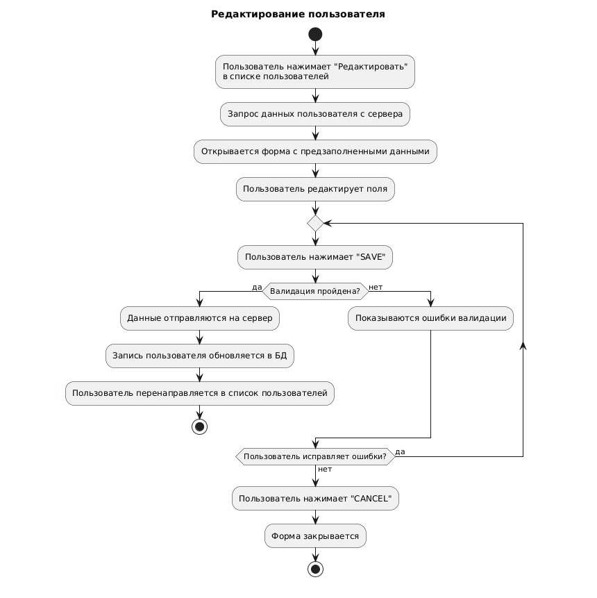
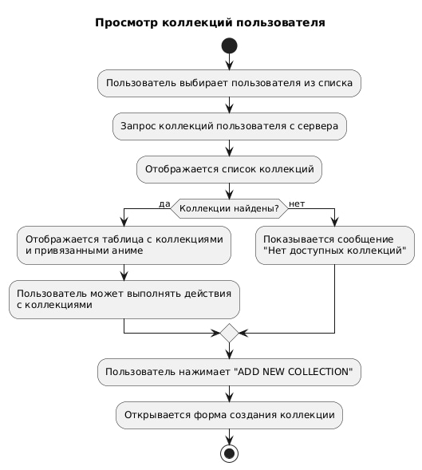

# 📊 Диаграммы активностей — Anime Collection Manager

## 📑 Содержание

1. [Добавление аниме](#1)
2. [Редактирование пользователя](#2)
3. [Просмотр коллекций пользователя](#3)

---

### 1. Добавление аниме

---

### 2. Редактирование пользователя

---

### 3. Просмотр коллекций пользователя

