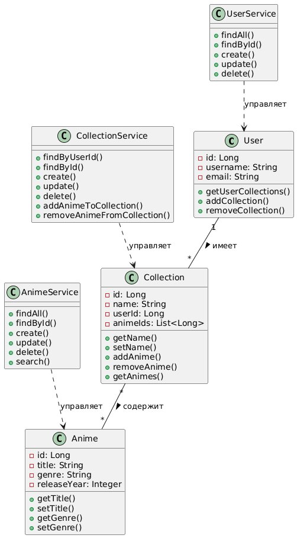

# Диаграмма классов

## Глоссарий

| Понятие | Описание |
|---------|-----------|
| User | Класс для пользователя: поля - идентификатор, username, email; коллекции - список коллекций. |
| Anime | Класс для аниме: идентификатор, title, genre, releaseYear; связи с коллекциями. |
| Collection | Класс для коллекции: идентификатор, name, userId; коллекции - список animeIds. |
