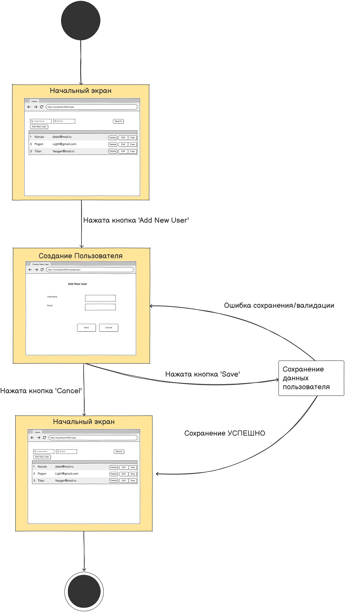
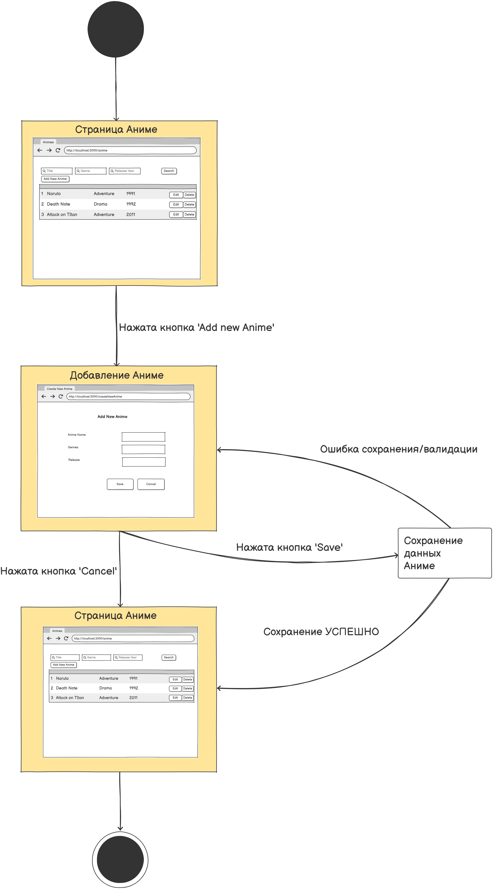
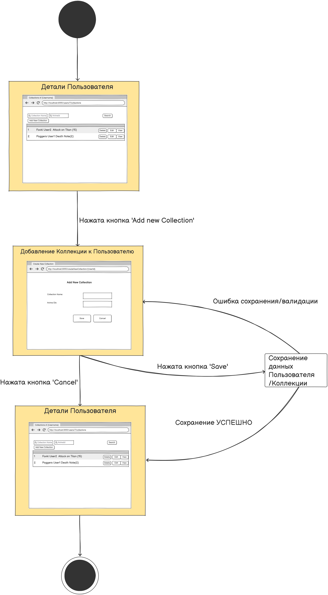

# Диаграмма состояний

# Содержание
1. [Создание пользователя](#1)
2. [Добавление аниме](#2)
3. [Добавление коллекции к пользователю](#3)

### 1. Создание пользователя

### 2. Добавление аниме

### 3. Добавление коллекции к пользователю

