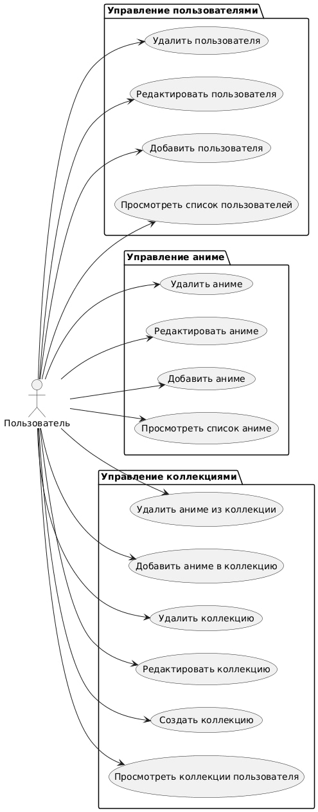

# 📘 Диаграмма вариантов использования — Anime Collection Manager

## 📚 Глоссарий

| Термин | Определение |
|--------|-------------|
| Пользователь | Человек, использующий веб-приложение для управления коллекциями аниме, пользователями и аниме-каталогом. |
| Аниме | Сущность, представляющая аниме-тайтл с атрибутами: название, жанр, год выпуска. |
| Коллекция | Сущность, принадлежащая пользователю, содержащая набор аниме с атрибутами: название, идентификатор пользователя. |
| Список | Отображение коллекций пользователей, аниме или коллекций в табличном виде. |

---

## 📑 Содержание

1. [Актёры](#1)
2. [Варианты использования](#2)  
   2.1 [Просмотреть список пользователей](#2.1)  
   2.2 [Добавить пользователя](#2.2)  
   2.3 [Редактировать пользователя](#2.3)  
   2.4 [Удалить пользователя](#2.4)  
   2.5 [Просмотреть список аниме](#2.5)  
   2.6 [Добавить аниме](#2.6)  
   2.7 [Редактировать аниме](#2.7)  
   2.8 [Удалить аниме](#2.8)  
   2.9 [Просмотреть коллекции пользователя](#2.9)  
   2.10 [Создать коллекцию](#2.10)  
   2.11 [Редактировать коллекцию](#2.11)  
   2.12 [Удалить коллекцию](#2.12)  
   2.13 [Добавить аниме в коллекцию](#2.13)  
   2.14 [Удалить аниме из коллекции](#2.14)

---

## 🎭 1. Актёры

| Актёр | Описание |
|-------|----------|
| Пользователь | Человек, использующий приложение для управления коллекциями аниме |

---

## 🎬 2. Варианты использования

### 2.1 Просмотреть список пользователей

Описание: Отображение всех пользователей в табличном виде.  
Предусловия: Пользователь находится на главном экране приложения.

Основной поток:
- Пользователь выбирает раздел "Пользователи" в навигации.
- Приложение запрашивает данные о пользователях с сервера.
- Отображается таблица с колонками: Username, Email, Действия.
- Пользователь видит кнопки: "Редактировать", "Удалить" для каждой строки таблицы.
- Пользователь нажимает кнопку "ADD NEW USER" для перехода к форме добавления.

Альтернативный поток А1:
- Если данных нет, таблица отображается пустой, и появляется сообщение "Нет доступных пользователей".

---

### 2.2 Добавить пользователя

Описание: Создание нового пользователя.  
Предусловия: Пользователь нажал кнопку "ADD NEW USER" на странице пользователей.

Основной поток:
- Отображается форма с полями: Username, Email.
- Пользователь вводит текст в поле "Username", затем в поле "Email".
- Пользователь нажимает кнопку "SAVE".
- Приложение отправляет данные на сервер для создания записи.
- При успехе пользователь видит сообщение "Пользователь добавлен", и происходит переход обратно на список пользователей.
- Список пользователей обновляется, новая строка появляется в таблице.

Альтернативный поток А2:
- При нажатии кнопки "SAVE" система проверяет поля: если какое-то поле пустое или email имеет некорректный формат, появляется сообщение об ошибке, и пользователь возвращается к заполнению формы.

---

### 2.3 Редактировать пользователя

Описание: Обновление существующего пользователя.  
Предусловия: Пользователь нажал кнопку "Редактировать" в строке таблицы для выбранного пользователя.

Основной поток:
- Приложение запрашивает данные пользователя по его идентификатору.
- Форма заполняется текущими значениями: пользователь видит предзаполненные поля "Username", "Email".
- Пользователь кликает в нужное поле, редактирует значение.
- Пользователь нажимает кнопку "SAVE".
- Приложение отправляет обновлённые данные на сервер.
- При успехе пользователь видит сообщение "Изменения сохранены", и происходит переход на список пользователей.

Альтернативный поток А3:
- Пользователь нажимает кнопку "CANCEL" в форме, и система возвращает его на предыдущий экран без сохранения.

---

### 2.4 Удалить пользователя

Описание: Удаление пользователя.  
Предусловия: Пользователь нажал кнопку "Удалить" в строке таблицы для выбранного пользователя.

Основной поток:
- Пользователь подтверждает действие, нажав "Да" в диалоговом окне "Удалить пользователя?".
- Приложение отправляет запрос на удаление данных пользователя.
- При успехе строка удаляется из таблицы, и список обновляется.

Альтернативный поток: Пользователь нажимает "Нет" в диалоге, и ничего не происходит.

---

### 2.5 Просмотреть список аниме

Описание: Отображение всех аниме в табличном виде.  
Предусловия: Пользователь находится в разделе "Anime List".

Основной поток:
- Приложение запрашивает данные об аниме с сервера.
- Отображается таблица с колонками: Title, Genre, Year, Действия.
- Пользователь видит кнопки: "Редактировать", "Удалить" для каждой строки таблицы.
- Пользователь нажимает кнопку "ADD NEW ANIME" для перехода к форме добавления.
- Пользователь может использовать поле "SEARCH" для поиска аниме по названию, жанру или году.

Альтернативный поток А4:
- Если данных нет, таблица отображается пустой, и появляется сообщение "Нет доступных аниме".

---

### 2.6 Добавить аниме

Описание: Создание нового аниме.  
Предусловия: Пользователь нажал кнопку "ADD NEW ANIME" на странице аниме.

Основной поток:
- Отображается форма с полями: Title, Genre, Release Year.
- Пользователь вводит текст в поле "Title", затем в поле "Genre", затем числовое значение в "Release Year".
- Пользователь нажимает кнопку "SAVE".
- Приложение отправляет данные на сервер для создания записи.
- При успехе пользователь видит сообщение "Аниме добавлено", и происходит переход обратно на список аниме.

Альтернативный поток А5:
- При нажатии кнопки "SAVE" система проверяет поля: если поле Title пустое или год выпуска некорректный, появляется сообщение об ошибке.

---

### 2.7 Редактировать аниме

Описание: Обновление существующего аниме.  
Предусловия: Пользователь нажал кнопку "Редактировать" в строке таблицы для выбранного аниме.

Основной поток:
- Приложение запрашивает данные аниме по его идентификатору.
- Форма заполняется текущими значениями полей.
- Пользователь редактирует необходимые поля.
- Пользователь нажимает кнопку "SAVE".
- Приложение отправляет обновлённые данные на сервер.
- При успехе происходит переход на список аниме, таблица обновляется.

---

### 2.8 Удалить аниме

Описание: Удаление аниме.  
Предусловия: Пользователь нажал кнопку "Удалить" в строке таблицы для выбранного аниме.

Основной поток:
- Пользователь подтверждает удаление в диалоговом окне.
- Приложение отправляет запрос на удаление аниме.
- При успехе строка удаляется из таблицы.

---

### 2.9 Просмотреть коллекции пользователя

Описание: Просмотр коллекций конкретного пользователя.  
Предусловия: Пользователь выбрал пользователя из списка.

Основной поток:
- Приложение запрашивает коллекции выбранного пользователя с сервера.
- Отображается таблица с колонками: Collection Name, Anime ID, Действия.
- Пользователь видит список коллекций с привязанными аниме (по ID).
- Пользователь нажимает кнопку "ADD NEW COLLECTION" для создания новой коллекции.

Альтернативный поток А6:
- Если коллекций нет, таблица отображается пустой с сообщением "Нет доступных коллекций".

---

### 2.10 Создать коллекцию

Описание: Создание новой коллекции для пользователя.  
Предусловия: Пользователь нажал кнопку "ADD NEW COLLECTION" на странице коллекций.

Основной поток:
- Отображается форма с полями: Collection Name, выбор аниме для добавления.
- Пользователь вводит название коллекции и выбирает аниме из доступного списка.
- Пользователь нажимает кнопку "SAVE".
- Приложение отправляет данные на сервер для создания коллекции.
- Происходит переход обратно на страницу коллекций пользователя.

---

### 2.11 Редактировать коллекцию

Описание: Обновление существующей коллекции.  
Предусловия: Пользователь нажал кнопку "Редактировать" для выбранной коллекции.

Основной поток:
- Приложение запрашивает данные коллекции.
- Форма заполняется текущими значениями.
- Пользователь изменяет название коллекции или состав аниме.
- Пользователь нажимает кнопку "SAVE".
- Приложение отправляет обновлённые данные на сервер.
- Таблица коллекций обновляется после возврата.

---

### 2.12 Удалить коллекцию

Описание: Удаление коллекции.  
Предусловия: Пользователь нажал кнопку "Удалить" для выбранной коллекции.

Основной поток:
- Пользователь подтверждает удаление в диалоговом окне.
- Приложение отправляет запрос на удаление коллекции.
- Строка удаляется из таблицы коллекций.

---

### 2.13 Добавить аниме в коллекцию

Описание: Добавление аниме в существующую коллекцию.  
Предусловия: Пользователь находится в режиме редактирования коллекции.

Основной поток:
- В форме редактирования коллекции пользователь выбирает аниме из доступного списка.
- Пользователь нажимает кнопку добавления.
- Аниме добавляется в коллекцию.
- Изменения сохраняются при нажатии "SAVE".

---

### 2.14 Удалить аниме из коллекции

Описание: Удаление аниме из коллекции.  
Предусловия: Пользователь находится в режиме редактирования коллекции.

Основной поток:
- В форме редактирования коллекции пользователь выбирает аниме для удаления из коллекции.
- Пользователь нажимает кнопку удаления.
- Аниме удаляется из коллекции.
- Изменения сохраняются при нажатии "SAVE".