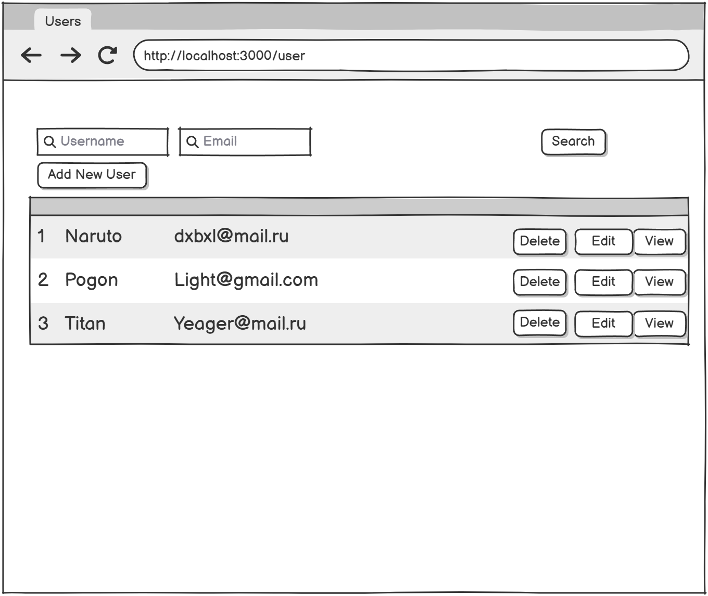
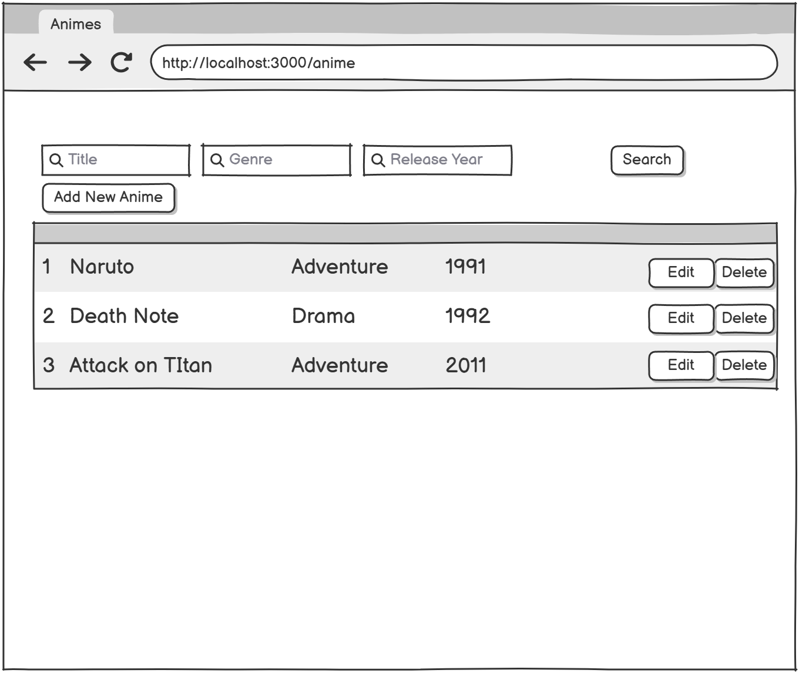
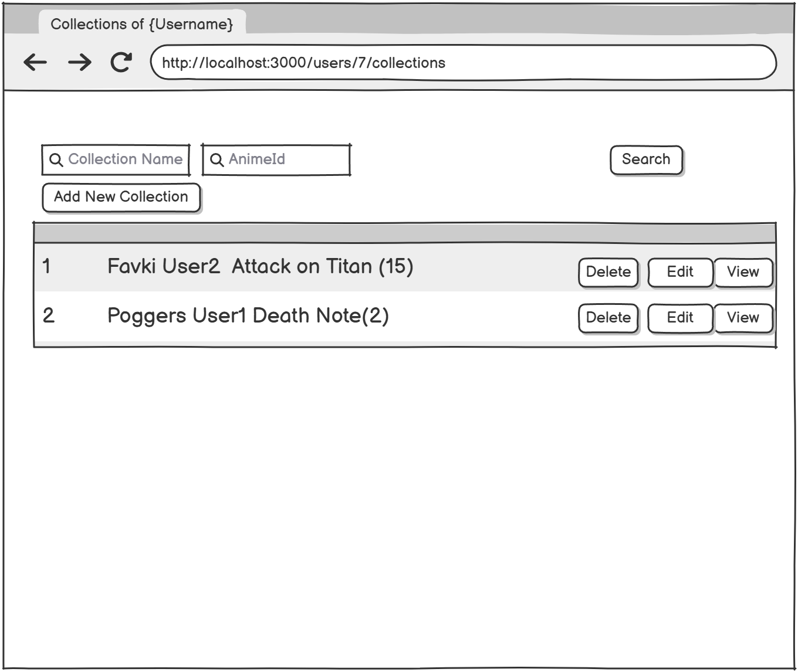
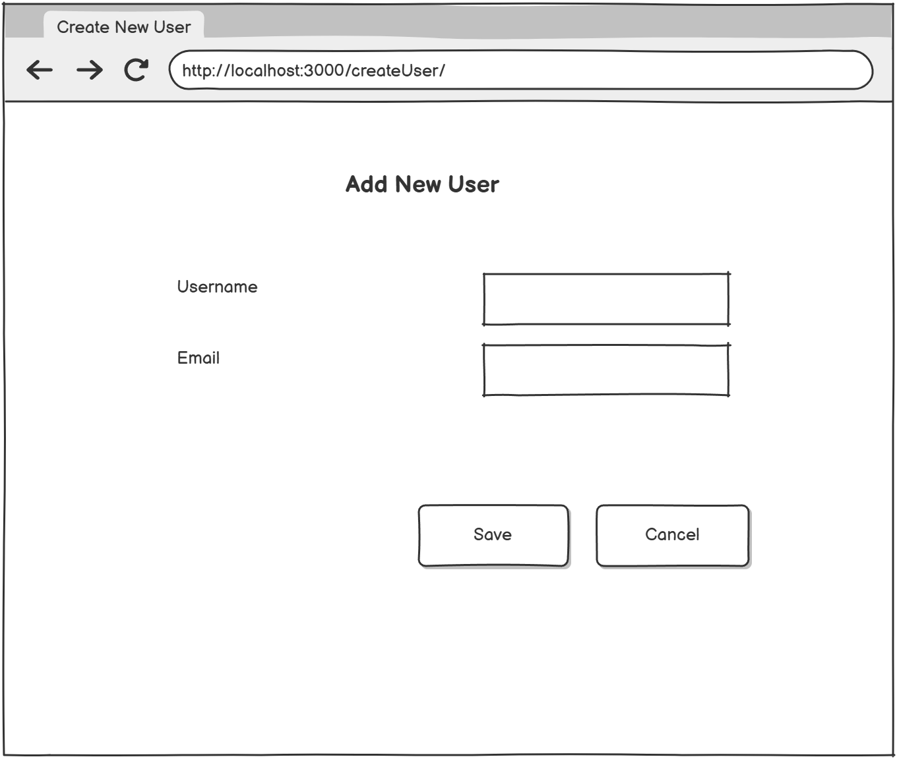
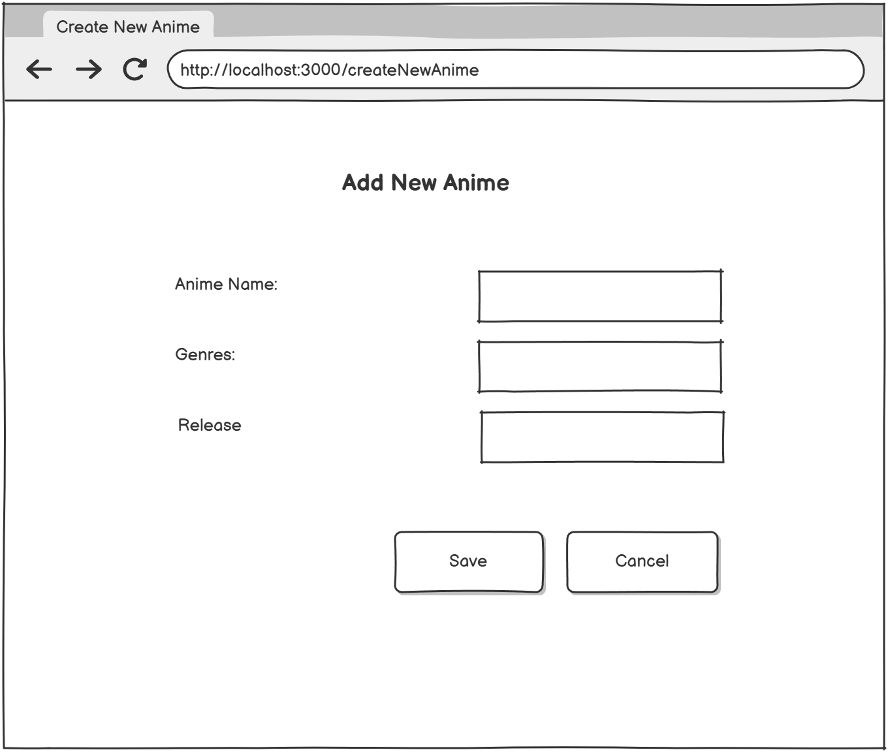
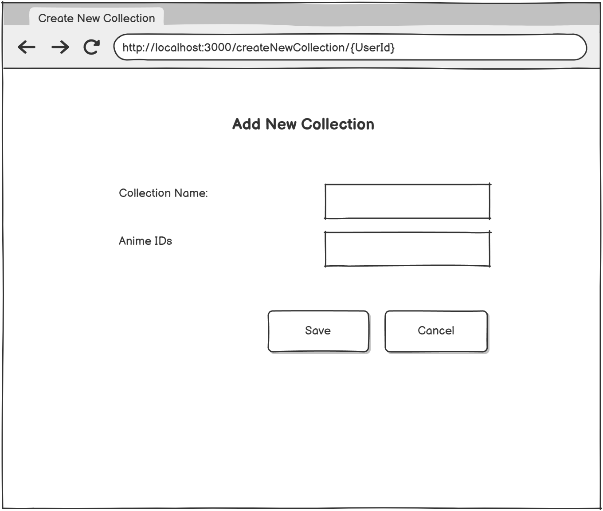

# Техническая документация: Anime Collection Manager

## 1 Введение

### 1.1 Контекст проекта
Anime Collection Manager — это веб-приложение для управления персональными коллекциями аниме, предназначенное для любителей аниме и коллекционеров. Приложение позволяет пользователям систематизировать просмотренный контент, создавать тематические коллекции и управлять каталогом аниме. Основные возможности включают CRUD-операции для пользователей, аниме и коллекций, поиск по различным параметрам и установление связей между сущностями.

Целевая аудитория:
- Энтузиасты аниме, желающие каталогизировать просмотренный контент
- Коллекционеры, создающие тематические подборки
- Администраторы, управляющие базой данных аниме

Технологический стек:
- Frontend: React 18+ с TypeScript, Material-UI (MUI) для компонентов, React Router для маршрутизации
- Backend: Spring Boot 3.x с Spring Data JPA, REST API
- База данных: PostgreSQL для хранения структурированных данных
- HTTP-клиент: Axios для взаимодействия с API

### 1.2 Границы проекта

Что продукт будет делать:
- Управление пользователями: создание, редактирование, удаление, поиск по username/email
- Управление каталогом аниме: CRUD операции с полями title, genre, releaseYear
- Создание и управление коллекциями: привязка к пользователям, добавление/удаление аниме
- Поиск и фильтрация: по названию, жанру, году выпуска для аниме; по имени для коллекций
- RESTful API интеграция между frontend и backend
- Хранение данных в реляционной БД PostgreSQL с JPA-маппингом
- Responsive-дизайн для работы на различных устройствах

Чего продукт не будет делать:
- Система аутентификации и авторизации пользователей
- Социальные функции (комментарии, рейтинги, обмен коллекциями)
- Рекомендательная система на основе машинного обучения
- Интеграция с внешними API аниме-каталогов (MyAnimeList, AniList)
- Мобильное приложение (только веб-интерфейс)
- Офлайн-режим работы
- Мультиязычная поддержка интерфейса

## 2 Требования пользователя

### 2.1 Программные интерфейсы

Архитектура приложения:
Frontend (React) ← HTTP/REST → Backend (Spring Boot) ← JDBC → PostgreSQL

Backend-фреймворк:
- Spring Boot 3.x для REST API и бизнес-логики
- Spring Data JPA для ORM и работы с базой данных
- Spring Web для обработки HTTP-запросов
- PostgreSQL драйвер для подключения к БД
- CORS конфигурация для взаимодействия с frontend

База данных:
- PostgreSQL 14+ с схемой для хранения users, animes, collections
- Таблицы: users (id, username, email), animes (id, title, genre, release_year), collections (id, name, user_id), collection_animes (collection_id, anime_id)

Frontend-фреймворк:
- React 18+ с функциональными компонентами и хуками
- React Router DOM для клиентской маршрутизации
- Material-UI (MUI) v5 для компонентов интерфейса
- Axios для HTTP-запросов к API

API-эндпоинты:

| Метод | Эндпоинт | Описание |
|-------|-----------|-----------|
| GET | /api/animes | Получить список аниме |
| POST | /api/animes | Создать новое аниме |
| PUT | /api/animes/{id} | Обновить аниме |
| DELETE | /api/animes/{id} | Удалить аниме |
| GET | /api/animes/search | Поиск аниме по параметрам |
| POST | /api/animes/bulk | Массовое создание аниме |
| GET | /api/users | Получить список пользователей |
| POST | /api/users | Создать нового пользователя |
| PUT | /api/users/{id} | Обновить пользователя |
| DELETE | /api/users/{id} | Удалить пользователя |
| GET | /api/users/search | Поиск пользователей |
| GET | /api/users/{id}/full | Получить пользователя с коллекциями |
| GET | /api/collections | Получить список коллекций |
| POST | /api/collections | Создать коллекцию |
| PUT | /api/collections/{id} | Обновить коллекцию |
| DELETE | /api/collections/{id} | Удалить коллекцию |
| GET | /api/collections/user/{userId} | Коллекции пользователя |
| GET | /api/collections/search | Поиск коллекций |
| GET | /api/collections/search/anime | Поиск коллекций по аниме |
| POST | /api/collections/bulk | Массовое создание коллекций |

Зависимости проекта:
```
{
    "frontend": {
        "react": "^18.2.0",
        "react-dom": "^18.2.0",
        "react-router-dom": "^6.8.0",
        "@mui/material": "^5.11.0",
        "@emotion/react": "^11.10.0",
        "@emotion/styled": "^11.10.0",
        "axios": "^1.2.0"
    },
    "backend": {
        "spring-boot-starter-web": "3.0.0",
        "spring-boot-starter-data-jpa": "3.0.0",
        "postgresql": "42.5.0",
        "spring-boot-starter-validation": "3.0.0"
    }
}
```

### 2.2 Интерфейс пользователя

Структура интерфейса:
- Главная страница: Навигация между разделами (Пользователи, Аниме, Коллекции)
- Списки сущностей: Таблицы с поиском и действиями CRUD
- Модальные окна: Создание и редактирование записей
- Навигация: Хлебные крошки и ссылки между связанными сущностями

#### Мокапы интерфейсов:

Главная страница / Список пользователей<br>


*Описание:*
- Заголовок "Users" с поиском по username/email
- Таблица пользователей с колонками: Username, Email
- Кнопка "ADD NEW USER" для открытия модального окна создания
- Список существующих пользователей с действиями редактирования/удаления
- Material-UI компоненты: AppBar, Table, TextField, Button, IconButton

Страница списка аниме с поиском<br>


*Описание:*
- Заголовок "Anime List" с поиском по title/genre/year
- Таблица аниме с колонками: Title, Genre, Year
- Кнопка "ADD NEW ANIME" для создания записи
- Список аниме с примерами: "Naurido (Adventure • 2002)", "Attack on Titan (Action • 2013)"
- Material-UI компоненты: DataGrid, Chip для жанров, SearchBar

Страница коллекций пользователя<br>


*Описание:*
- Заголовок "Collections for User [username]"
- Таблица коллекций: Collection Name, Admin ID, поиск
- Кнопка "ADD NEW COLLECTION"
- Список коллекций с привязанными аниме (ID ссылки)
- Material-UI компоненты: Card, List, Avatar, Badge

Модальное окно создания/редактирования пользователя<br>


*Описание:*
- Форма с полями: Username* (обязательное), Email* (обязательное)
- Валидация: формат email, уникальность username
- Кнопки действий: CANCEL, SAVE
- Material-UI компоненты: Dialog, TextField, FormControl, Button

Модальное окно создания/редактирования аниме<br>


*Описание:*
- Форма с полями: Title* (обязательное), Genre, Release Year
- Валидация года: 1900-текущий год
- Выпадающий список жанров или текстовое поле
- Кнопки: CANCEL, SAVE
- Material-UI компоненты: Dialog, Select, MenuItem, TextField

Модальное окно создания/редактирования коллекции<br>


*Описание:*
- Поля: Collection Name* (обязательное), User (привязка), Animes (мультиселект)
- Список доступных аниме для добавления в коллекцию
- Отображение выбранных аниме с возможностью удаления
- Кнопки: CANCEL, SAVE
- Material-UI компоненты: Dialog, Autocomplete, Chip, Checkbox

Пользовательские сценарии:

| Действие пользователя | Реакция системы |
|----------------------|-----------------|
| Пользователь вводит текст в поле поиска аниме | Система отправляет запрос к /api/animes/search и обновляет список результатов в реальном времени |
| Пользователь нажимает "ADD NEW USER" | Открывается модальное окно с формой создания пользователя с валидацией обязательных полей |
| Пользователь выбирает пользователя из списка | Система перенаправляет на страницу коллекций выбранного пользователя (/collections/user/{userId}) |
| Пользователь создает коллекцию и выбирает аниме | Система валидирует уникальность имени коллекции для пользователя и создает связи в таблице collection_animes |
| Пользователь редактирует существующее аниме | Система предзаполняет форму текущими значениями и отправляет PUT запрос при сохранении |

### 2.3 Характеристики пользователей

Группы пользователей:

1. Основные пользователи (любители аниме)
    - Демография: Возраст 16-35 лет, преимущественно студенты и молодые специалисты
    - Образование: Среднее-высшее образование
    - Технические навыки: Базовые навыки работы с веб-интерфейсами, знакомы с современными UI паттернами
    - Ожидания: Простота использования, быстрый доступ к коллекциям, интуитивная навигация
    - Мотивация: Систематизация просмотренного контента, создание тематических подборок

2. Администраторы контента
    - Демография: Возраст 25-45 лет, технические специалисты или модераторы сообществ
    - Образование: Высшее техническое или гуманитарное образование
    - Технические навыки: Средние-продвинутые навыки, понимание структуры данных, опыт работы с CMS
    - Ожидания: Эффективные инструменты массового управления данными, валидация вводимой информации, отчеты о активности
    - Мотивация: Поддержание актуальности каталога, обеспечение качества данных, модерирование контента

### 2.4 Предположения и зависимости

Предположения:
- Пользователи имеют доступ к современным браузерам (Chrome 90+, Firefox 88+, Safari 14+, Edge 90+) с поддержкой ES6+
- Backend API доступен на http://localhost:8080 в development и на выделенном домене в production
- PostgreSQL 14+ развернута и настроена с необходимыми таблицами и индексами
- Стабильное интернет-соединение для работы с API (минимальная скорость 1 Мбит/с)
- JavaScript включен в браузерах пользователей
- Разрешение экрана не менее 1024x768 для корректного отображения интерфейса

Зависимости:
- Spring Boot backend: Риск простоев влияет на все операции frontend. Мониторинг здоровья через Spring Boot Actuator
- PostgreSQL: Требуется регулярное резервное копирование и мониторинг производительности запросов
- Версии библиотек: Фиксированные версии в package.json и pom.xml. Обновления React/MUI/Spring Boot могут потребовать рефакторинга кода
- CORS конфигурация: Должна быть корректно настроена для взаимодействия frontend-backend на разных доменах
- Факторы влияния:
    - Рост количества данных (>10000 записей аниме) может потребовать оптимизации запросов и реализации пагинации
    - Увеличение количества concurrent пользователей (>200) может потребовать горизонтального масштабирования backend
    - Изменения в структуре API требуют синхронного обновления frontend компонентов

## 3 Системные требования

### 3.1 Функциональные требования

Управление пользователями:
1. FR-01: Система должна позволять просмотр списка пользователей с пагинацией (20 записей на страницу)
2. FR-02: Система должна поддерживать создание пользователей с валидацией: username (обязательное, 3-50 символов, уникальное), email (обязательное, валидный формат, уникальное)
3. FR-03: Система должна предоставлять редактирование данных пользователя с проверкой уникальности изменяемых полей
4. FR-04: Система должна позволять удаление пользователя с каскадным удалением связанных коллекций
5. FR-05: Система должна обеспечивать поиск пользователей по username и email с поддержкой частичного совпадения

Управление аниме:
6. FR-06: Система должна отображать каталог аниме с колонками: Title, Genre, Release Year
7. FR-07: Система должна поддерживать создание записей аниме с валидацией: title (обязательное, 1-255 символов), genre (1-100 символов), releaseYear (1900-текущий год)
8. FR-08: Система должна предоставлять редактирование аниме с сохранением истории изменений
9. FR-09: Система должна позволять удаление аниме только если оно не связано с коллекциями
10. FR-10: Система должна обеспечивать поиск аниме по title (полное/частичное совпадение), genre (точное совпадение), releaseYear (диапазон)


Управление коллекциями:
11. FR-11: Система должна отображать коллекции пользователя с привязанными аниме
12. FR-12: Система должна поддерживать создание коллекций с валидацией: name (обязательное, 1-255 символов, уникальное для пользователя), userId (существующий пользователь)
13. FR-13: Система должна позволять добавление/удаление аниме в коллекции с проверкой существования аниме
14. FR-14: Система должна предоставлять редактирование названия коллекции и состава аниме
15. FR-15: Система должна обеспечивать поиск коллекций по name и связанным animeId

Системные функции:
16. FR-16: Система должна обрабатывать ошибки API (4xx, 5xx) и отображать понятные сообщения пользователю
17. FR-17: Система должна поддерживать bulk-операции для массового создания аниме и коллекций через JSON импорт
18. FR-18: Система должна обеспечивать responsive-дизайн для работы на устройствах с шириной экрана от 320px до 4K
19. FR-19: Backend должен предоставлять RESTful API с поддержкой JSON для всех операций CRUD
20. FR-20: Система должна валидировать данные на frontend (immediate feedback) и backend (security validation)

### 3.2 Нефункциональные требования

#### 3.2.1 Атрибуты качества

| Атрибут качества | Почему важен | Как измеряется | Целевые показатели |
|-------------------|--------------|---------------|-------------------|
| Производительность | Быстрая загрузка списков и отклик на действия пользователя критичны для UX; медленные запросы к БД снижают удовлетворенность | Время загрузки страницы, время отклика API, throughput, время выполнения запросов к БД | Время загрузки страницы < 1 сек; время отклика API < 300ms; throughput > 50 запросов/сек; БД запросы < 100ms |
| Удобство использования | Интуитивный интерфейс снижает порог входа для новых пользователей; Material-UI обеспечивает знакомые паттерны взаимодействия | SUS (System Usability Scale), время на выполнение типовых задач, A/B-тестирование форм, коэффициент ошибок пользователей | SUS score > 75%; создание коллекции < 2 минут; успешное выполнение задач > 90% |
| Надёжность | Стабильная работа при взаимодействии с API; потеря данных недопустима для пользовательских коллекций | Uptime, корректность обработки HTTP-ошибок, MTBF, частота инцидентов потери данных | Uptime >= 99%; обработка всех HTTP-статусов; MTBF > 168 часов; zero data loss |
| Масштабируемость | Поддержка роста количества пользователей и данных без деградации производительности | Производительность при росте данных, эффективность горизонтального масштабирования, результаты нагрузочного тестирования | Эффективная работа с 10000+ записей; масштабирование до 200 concurrent users; response time degradation < 20% при 2x нагрузке |
| Поддерживаемость | Модульная архитектура облегчает добавление новых функций; разделение frontend/backend упрощает независимое развертывание | Code coverage, время на фикс багов, качество документации, модульность кода | Code coverage > 70%; время на фикс критичных багов < 4 часов; полная документация API |
| Безопасность | Защита от XSS, SQL-инъекций и CSRF; валидация данных на всех уровнях предотвращает некорректный ввод | Результаты security scanning, соответствие OWASP Top 10, аудит кода на уязвимости | Zero critical vulnerabilities; соответствие OWASP Top 10; параметризованные запросы к БД |
| Совместимость | Поддержка различных браузеров и устройств расширяет аудиторию | Тестирование на целевых браузерах, responsive-тестирование, кросс-браузерное тестирование | Поддержка Chrome, Firefox, Safari, Edge (последние 2 версии); корректное отображение на экранах 320px-4K |

```
Метрики мониторинга:
- Frontend: Core Web Vitals (LCP, FID, CLS), ошибки JavaScript, время загрузки компонентов
- Backend: Время ответа API, частота ошибок, использование CPU/памяти, метрики БД
- Бизнес-метрики: Активные пользователи, количество созданных коллекций, среднее время сессии
```
